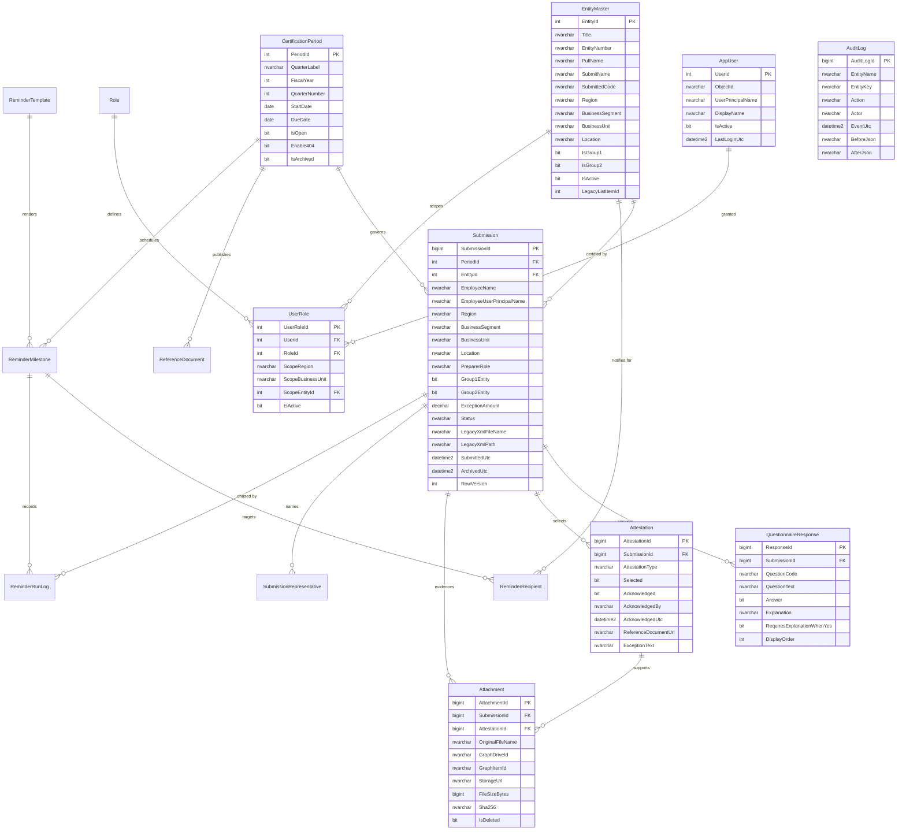
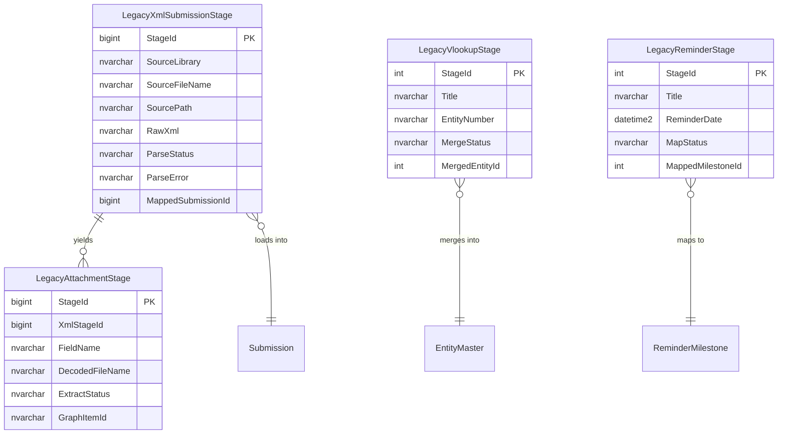

# Entity Relationship Diagram

## Logical model

## Migration staging (isolated — no FK to the operational schema)

## Cardinality notes

| Relationship | Rule |
|---|---|
| CertificationPeriod → Submission | One open period may hold many submissions; a submission belongs to exactly one period. |
| EntityMaster → Submission | Optional (`EntityId` is nullable) so a legacy XML row with an unmatched entity still imports rather than failing. |
| Submission → QuestionnaireResponse | Exactly 10 rows seeded at draft creation, plus 1 threshold row per applicable group. |
| Submission → Attestation | One row per available module (4 normally, 5 when `Enable404`), each with its own `Selected` / `Acknowledged` flags. |
| Attestation → Attachment | Optional — evidence can attach to the submission generally or to a specific module. |
| UserRole scope columns | All NULL = unscoped grant. Any populated column narrows the reviewer's row-level visibility. |
